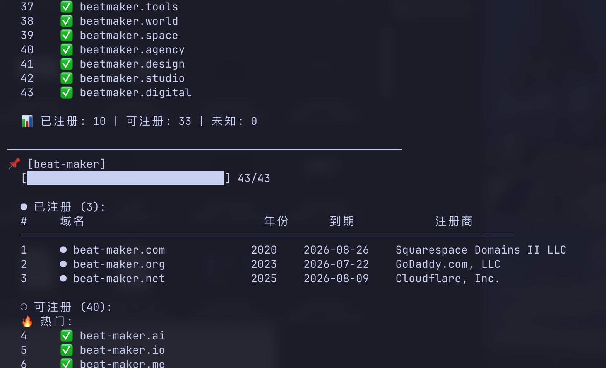
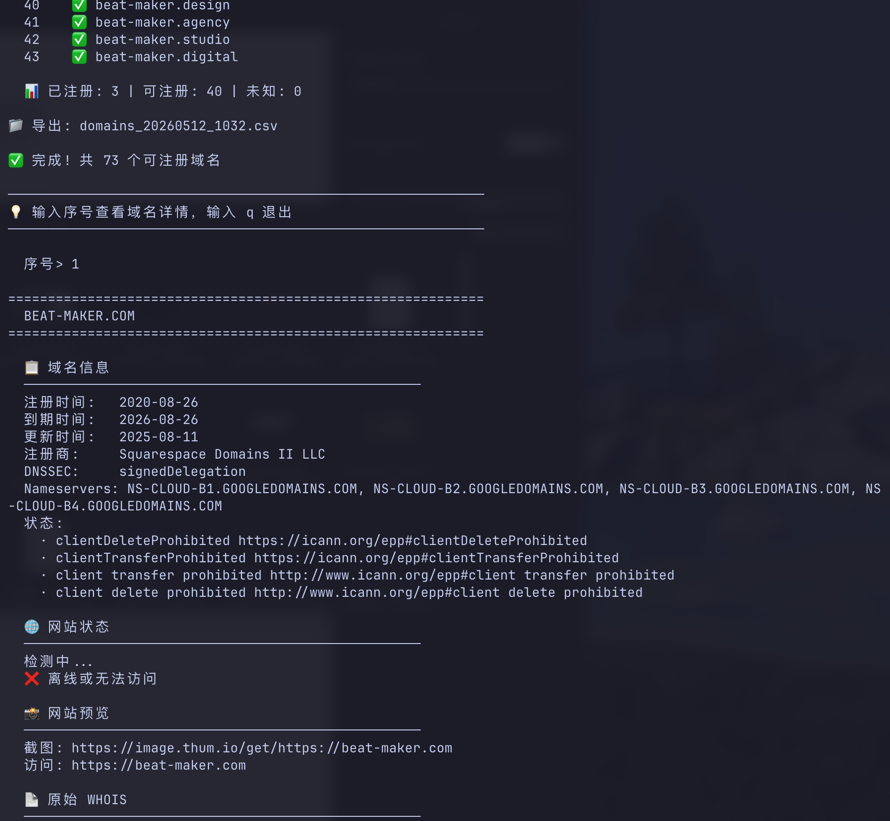

# domain-checker

Fast bulk domain availability checker via WHOIS. No CAPTCHAs, no rate limits, no browser needed.

**Web version:** [domain-checker.online](https://domain-checker.online)

## Features

- **Bulk check** — 42 popular TLDs by default, up to 1500+ with `--all`
- **WHOIS details** — Registration date, expiry, registrar, nameservers, status
- **Auto variants** — `beatmaker` automatically checks `beat-maker` too (powered by [wordninja](https://github.com/keredson/wordninja))
- **Interactive detail view** — Pick any domain to see full WHOIS, site status, screenshot link, and raw WHOIS data
- **Concurrent** — 10 parallel lookups by default, configurable with `-w`
- **CSV export** — Save results for later

## Install

```bash
git clone https://github.com/charlotte-wang-dev/domain-checker.git
cd domain-checker
bash setup.sh
source .venv/bin/activate
```

## Screenshots

### Bulk check with auto hyphen variants


### Interactive detail view (WHOIS, site status, preview, raw data)


## Usage

```bash
# Basic — check 42 popular TLDs + auto hyphen variant
python3 domain_checker.py beatmaker

# Extended — ~250 TLDs
python3 domain_checker.py beatmaker -e

# All IANA TLDs (1500+)
python3 domain_checker.py beatmaker --all

# Specific TLDs only
python3 domain_checker.py beatmaker --tld com,ai,io,dev,app

# Multiple keywords
python3 domain_checker.py beatmaker logomaker voicecloner

# From file (one keyword per line)
python3 domain_checker.py --file keywords.txt

# Only show available domains
python3 domain_checker.py beatmaker -a

# Export to CSV
python3 domain_checker.py beatmaker --export results.csv

# Skip hyphen variants
python3 domain_checker.py beatmaker --no-variants

# Skip interactive mode
python3 domain_checker.py beatmaker -n

# More concurrent workers (faster but may get throttled)
python3 domain_checker.py beatmaker -w 20
```

## Example output

```
  🔀 beatmaker → beatmaker, beat-maker

============================================================
🔍 域名检查: 2 词根 × 6 TLD | 并发: 10
============================================================

📌 [beatmaker]

  ● 已注册 (3):
  #     域名                           年份      到期            注册商
  ───────────────────────────────────────────────────────────────────────────
  1     ● beatmaker.com              2002    2027-05-23    GoDaddy.com, LLC
  2     ● beatmaker.io               2019    2026-07-02    NAMECHEAP INC
  3     ● beatmaker.ai               2025    2027-09-28    NAMECHEAP INC

  ○ 可注册 (3):
  🔥 热门:
  4     ✅ beatmaker.app
  5     ✅ beatmaker.dev
  6     ✅ beatmaker.run

📌 [beat-maker]

  ○ 可注册 (5):
  🔥 热门:
  2     ✅ beat-maker.ai
  3     ✅ beat-maker.io
  4     ✅ beat-maker.app
  5     ✅ beat-maker.dev
  6     ✅ beat-maker.run
```

After the list, enter a number to see full details (WHOIS, site status, screenshot, raw data). Enter `q` to quit.

## Interactive detail view

```
============================================================
  BEATMAKER.COM
============================================================

  📋 域名信息
  ──────────────────────────────────────────────────
  注册时间:   2002-05-23
  到期时间:   2027-05-23
  注册商:     GoDaddy.com, LLC
  Nameservers: NS1.NAMEFIND.COM, NS2.NAMEFIND.COM

  🌐 网站状态
  ──────────────────────────────────────────────────
  ✅ 在线 | HTTP 200

  📸 网站预览
  ──────────────────────────────────────────────────
  截图: https://image.thum.io/get/https://beatmaker.com

  📄 原始 WHOIS
  ──────────────────────────────────────────────────
  Domain Name: BEATMAKER.COM
  Registry Domain ID: 86884520_DOMAIN_COM-VRSN
  ...
```

## License

MIT
